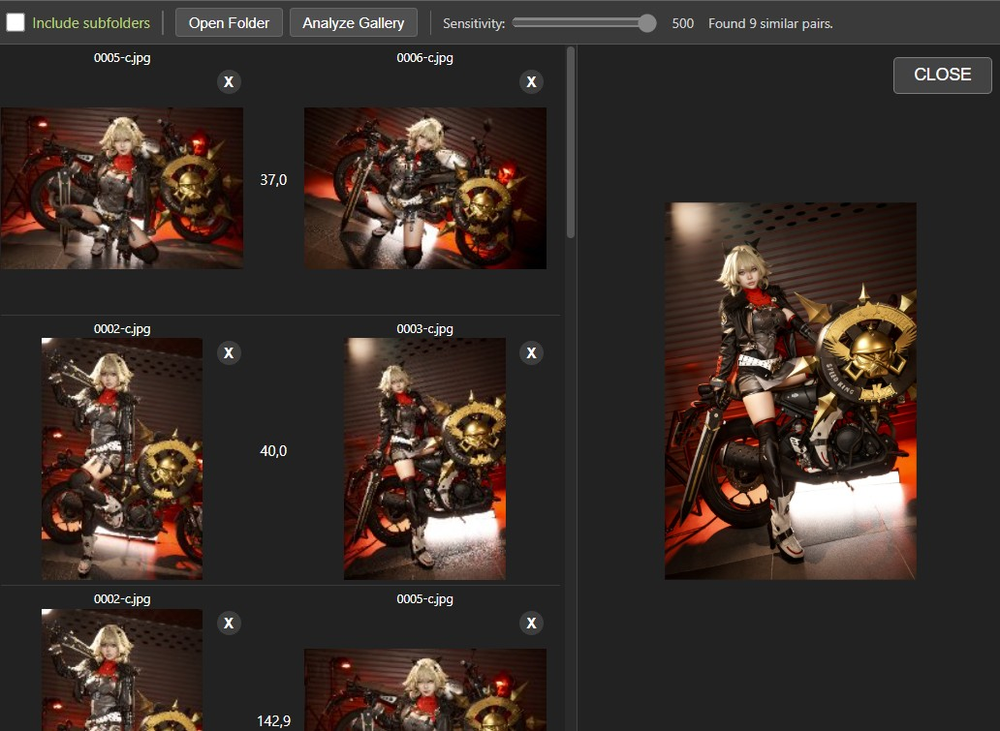

# Dupless Finder

A duplicate image detection and management tool that uses **SIFT (Scale-Invariant Feature Transform)** to find visually similar images.<br/>Available as both a **Windows desktop app** (WPF) and a **web app** (Blazor WebAssembly).

<br/>
<br/>

<p align="center">
  <b><big>🔒 All processing runs entirely client-side.</big></b><br>
  No images are uploaded to any server. The desktop app runs natively on your machine,<br>
  and the web app runs fully in the browser via WebAssembly.<br>
  <b>Your photos never leave your device.</b>
</p>

<br/>
<br/>

<p align="center">

</p>


## Features

- **Visual similarity detection** — Uses SIFT feature extraction and FLANN-based descriptor matching to identify duplicate or near-duplicate images, even if they've been resized, cropped, or slightly edited
- **Configurable sensitivity** — Adjustable similarity threshold (20–500) to control how strict matching should be
- **Side-by-side preview** — View matched image pairs with zoom controls to compare visually
- **Safe deletion** — Deleted images are moved to a `.deleted` folder for easy recovery via undo
- **Smart caching** — SIFT descriptors and thumbnails are cached (SQLite on desktop, IndexedDB on web) using a fingerprint of file size + last modified time, so re-scanning is fast
- **Recursive folder scanning** — Scan directories with optional subfolder inclusion
- **Progress tracking** — Real-time progress indicators during scanning and comparison
- **Multi-threaded processing** — Parallel SIFT computation on desktop; Web Worker pool on the web version

## How It Works

1. **Scan** — Select a folder to scan. The app reads all image files and extracts metadata (path, size, modified date).
2. **Extract features** — SIFT descriptors are computed for each image thumbnail. Results are cached so subsequent scans skip already-processed files.
3. **Match** — Each image pair is compared using FLANN-based descriptor matching. A similarity score is calculated based on the number of good matches.
4. **Review** — Image pairs exceeding the similarity threshold are displayed. You can preview pairs side-by-side, adjust the sensitivity slider, and delete unwanted duplicates.

## Architecture

```
┌─────────────────────────────────────────────────┐
│                   UI Layer                      │
│   WPF (MVVM/Prism)   │  Blazor WASM (Razor)     │
├─────────────────────────────────────────────────┤
│              Business Logic                     │
│   CalcOperations · ThumbnailService             │
│   LoadingOperations · FileAccessService         │
├─────────────────────────────────────────────────┤
│              Data / Caching                     │
│   SQLite + EF Core (Desktop)                    │
│   IndexedDB via JS Interop (Web)                │
├─────────────────────────────────────────────────┤
│            Computer Vision                      │
│   OpenCvSharp4 (Desktop)                        │
│   OpenCV.js + Web Workers (Web)                 │
└─────────────────────────────────────────────────┘
```

## Tech Stack

- **Language:** C# / .NET 8.0
- **Computer Vision:** OpenCvSharp4 (desktop), OpenCV.js (web)
- **Desktop UI:** WPF with Prism MVVM framework
- **Web UI:** Blazor WebAssembly with Razor components
- **Database:** Entity Framework Core + SQLite (desktop), IndexedDB (web)
- **Reactive Programming:** System.Reactive (Rx.NET)
- **Image Metadata:** MetadataExtractor
- **Testing:** xUnit, bUnit, Moq, FluentAssertions

## Getting Started

### Prerequisites

- [.NET 8.0 SDK](https://dotnet.microsoft.com/download/dotnet/8.0)

### Build

```bash
dotnet build Dupless_finder.sln
```

### Run the Desktop App

```bash
dotnet run --project Dupples_finder_UI
```

### Run the Web App

```bash
dotnet watch run --project DuplessFinder.Web
```

The web app launches at `http://localhost:5200`.

> **Note:** The web version requires Cross-Origin Embedder Policy (COEP) and Cross-Origin Opener Policy (COOP) headers for SharedArrayBuffer support, which are configured automatically.

### Run Tests

```bash
dotnet test
```


## Database Schema

The desktop app persists data in a SQLite database:

- **Photos** — Stores file path, SIFT descriptors (as BLOB), thumbnails, and a unique fingerprint index on `(FileSize, LastModifiedUtc)`
- **SimilarityResults** — Stores computed similarity scores between photo pairs to avoid redundant comparisons

## Deployment

The web version can be deployed to:

- **Azure Static Web Apps** — configured via `staticwebapp.config.json`
- **Cloudflare Pages** — supported with proper COEP/COOP headers
